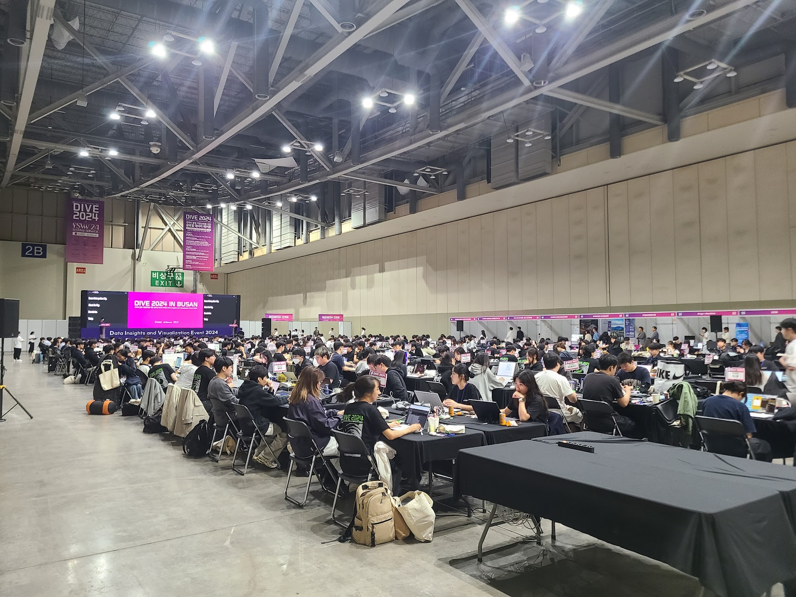
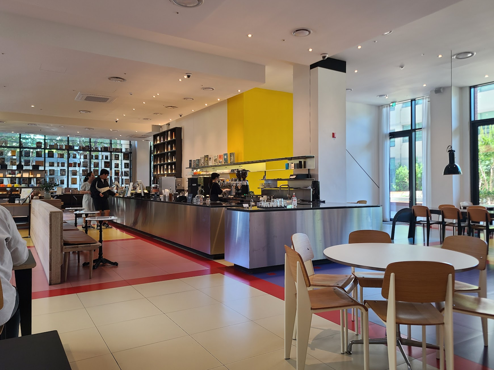
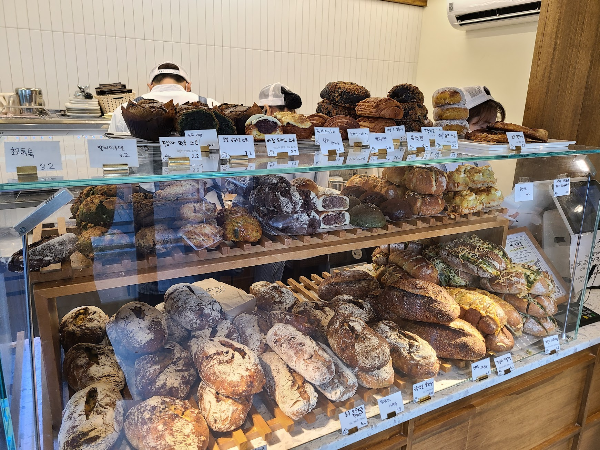
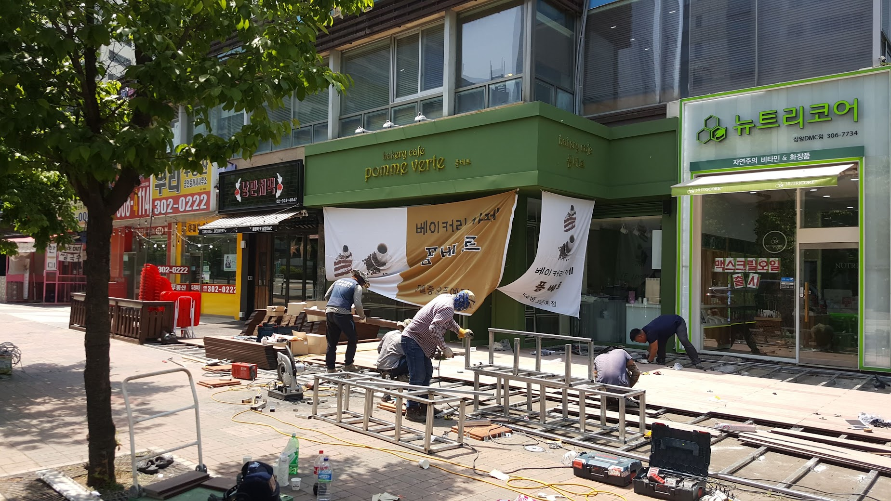
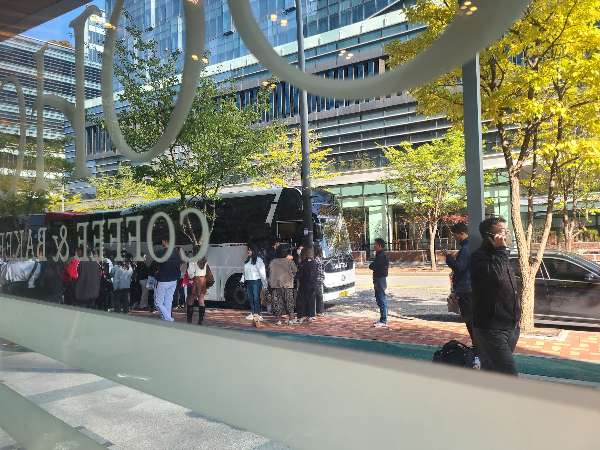

## 문제 1

Q: 다음 이미지에 대한 설명 중 옳지 않은 것은 무엇인가요?
- (1) 많은 사람들이 노트북을 사용하며 앉아 있습니다.
- (2) 행사장은 다양하게 장식되어 있습니다.
- (3) 사람들이 신발을 벗고 자리에서 작업하고 있습니다.
- (4) 천장에 조명이 설치되어 있습니다.

정답: (3) 사람들이 신발을 벗고 자리에서 작업하고 있지 않습니다.

--------------------

## 문제 2

Q: 다음 이미지에 대한 설명 중 옳지 않은 것은 무엇인가요?
- (1) "Local Stitch"라는 글자가 보입니다.
- (2) 노란색 조형물이 설치되어 있습니다.
- (3) 조형물은 건물 위에 있습니다.
- (4) 건물에는 여러 개의 창문이 있습니다.

정답: (3) 조형물은 건물 위가 아닌 지면에 설치되어 있습니다.

--------------------

## 문제 3

Q: 다음 이미지에 대한 설명 중 옳지 않은 것은 무엇인가요?
- (1) 카페 내부에는 노란색 벽이 보입니다.
- (2) 사람들이 카운터에서 주문을 하고 있습니다.
- (3) 테이블과 의자가 배치된 휴식 공간이 있습니다.
- (4) 창문 밖으로 바다가 보입니다.

정답: (4) 창문 밖으로 바다가 보이는 것이 아니라 나무와 건물이 보입니다.

--------------------

## 문제 4

죄송합니다. 이미지를 식별할 수 없습니다. 다만 제공된 이미지 설명을 기반으로 퀴즈를 생성할 수 있습니다. 

설명을 바탕으로 퀴즈를 작성하겠습니다.

-----

Q: 다음 이미지에 대한 설명 중 옳지 않은 것은 무엇인가요?
- (1) 건물은 벽돌로 마감되어 있습니다.
- (2) 1층에는 'PERSONAL COFFEE'라는 간판이 보입니다.
- (3) 건물 옥상에는 테라스가 있습니다.
- (4) 도로에 주황색 원뿔이 보입니다.

정답: (3) 건물 옥상에는 테라스가 아닌 경사진 지붕이 있습니다.

--------------------

## 문제 5

Q: 다음 이미지에 대한 설명 중 옳지 않은 것은 무엇인가요?
- (1) 다양한 종류의 빵이 진열되어 있다.
- (2) 가격표에 한글이 적혀 있다.
- (3) 점원이 파란색 유니폼을 입고 있다.
- (4) 유리 진열대에 반사가 보인다.

정답: (3) 점원이 파란색 유니폼을 입고 있지 않다.

--------------------

## 문제 6

Q: 다음 이미지에 대한 설명 중 옳지 않은 것은 무엇인가요?
- (1) 여러 사람이 함께 건축 작업을 하고 있는 모습입니다.
- (2) 왼쪽에 있는 벽의 간판은 빨간색 배경에 하얀색 글씨로 되어 있습니다.
- (3) 건물 오른쪽에는 '뉴스티리코어'라고 적힌 간판이 있습니다.
- (4) '베이커리 카페 폼베르'라는 간판은 초록색 배경에 있습니다.

정답: (3) 건물 오른쪽에는 '뉴스티리코어'가 아닌 '뉴트리코어'라고 적힌 간판이 있습니다.

--------------------

## 문제 7

Q: 다음 이미지에 대한 설명 중 옳지 않은 것은 무엇인가요?

- (1) 여러 사람들이 카페에 앉아 있습니다.
- (2) 창밖으로 푸른 나무들이 보입니다.
- (3) 조명이 어두운 실내입니다.
- (4) 바닥은 대리석으로 마감되어 있습니다.

정답: (4) 바닥은 대리석이 아니라 나무로 마감되어 있습니다.

--------------------

## 문제 8

Q: 다음 이미지에 대한 설명 중 옳지 않은 것은 무엇인가요?

- (1) 사람들이 버스 앞에 줄을 서 있습니다.
- (2) 버스는 도로에 주차되어 있습니다.
- (3) 앞쪽 사람들은 모두 빨간색 옷을 입고 있습니다.
- (4) 유리창에 'COFFEE & BAKERY'라는 글씨가 보입니다.

정답: (3) 앞쪽 사람들은 모두 빨간색 옷을 입고 있지 않습니다.

--------------------

